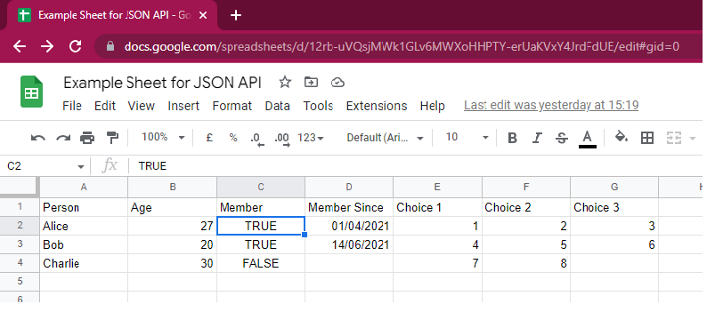

# stonechat
Chainlink External Adapter for Google Sheets

## Introduction

Google Sheets is more than just a simple spreadsheet. Is a proving ground for new business ideas, tokenomics, ideation and prototyping.
Stonechat is a Chainlink Adapter that helps node operators build a bridge to Google Sheets, so that web3 development teams can integrate data held in Google Sheets into their smart contracts.

Web3 teams can combine Chainlink Oracles and Google Sheets together to rapidly prototype new solutions by generating the right data in Google Sheets and using the adapter to bring the data on-chain.

The adapter supports the fetching of individual cells, rows, columns, and ranges. The adapter also type conversions to convert data into more compatible formats, such as dates to EVM timestamps.

## Ingredients you will need

You will need the following to get up and running with Stonechat

1. Google Sheet with some meaningfull data on it.
2. Google Sheets API key to programmatically allow access to the Google Sheet
3. A hosted instance of Stonechat.

## Hosting Stonechat

You have three options to host and run Stonechat
1. Build it from scratch, including your own Docker container image, and run it in the cloud in AWS, Heroku, Fly.io (recommended)
2. Use our latest Docker container image from Docker hub and run it in the cloud.
3. Get us to to host the external adapter for you. Come find us in the [Translucent Discord](https://discord.gg/JxKT6R9Xpz).

## Using the Stonechat

Lets use the following spreadsheet as an example:

### Cells

By calling the external adapter with the following path query

        /cell/:column/:row/:returnType
        /cell/c/2/b

Stonechat will return

    {
        "data": {
            "value": true
        }
    }

By calling the external adapter with the following path query

    /cell/b/2/n

Stonechat will return

    {
        "data": {
            "value": 27
        }
    }

### Columns

By calling the external adapter with the following path query

    /column/:column/:startRow/:endRow/:returnType
    /column/d/2/4/t

Stonechat will return

    {
        "data": {
            "value": [
                1617231600,
                1623625200,
                0
            ]
        }
    }

### Rows

By calling the external adapter with the following path query

    /row/:startColumn/:endColumn/:row/:returnType
    /row/e/g/1/s

Stonechat will return

    {
        "data": {
            "value": [
                "Choice 1",
                "Choice 2",
                "Choice 3"
            ]
        }
    }

### Ranges

By calling the external adapter with the following path query

    /range/:startColumn/:startRow/:endColumn/:endRow/:returnType
    /range/e/2/g/4/n

Stonechat will return

    {
        "data": {
            "value": [
                [
                    1,
                    2,
                    3
                ],
                [
                    4,
                    5,
                    6
                ],
                [
                    7,
                    8
                ]
            ]
        }
    }

### Return Types

Stonechat has the ability to convert (best effort) any data it retrieves into a native JSON-type. The last parameter on the path definitions shown above is the `:returnType`. The following return types are currently supported.

* `s` - returns a string by converting source data to string.
* `b` - return a bool `true` if the source data is some form of case-insensitive "TRUE", otherwise `false`.
* `n` - returns a number converting source data to a `float64`.
* `t` - converts a date-value to the number of seconds since the epoch, making it compatible with `block.timestamp`

# Building Stonechat
## Getting started

1. Clone the Stonechat repo and download the repo.
2. Install the go-dependencies

        go mod tidy

3. Run the server locally

        go run *.go

You should be able to access the following URLs:
- http://localhost:8080/cell - Main endpoint
- http://localhost:8080/health - Simple health=OK endpoint
- http://localhost:8080/metrics - Prometheus-based metrics endpoint

## Building & Shipping

To dockerize and upload the Docker container image run the build script:

    bin/build.sh 0.0.1

The above command will generate a Linux/AMD64-compatible Docker container image and upload it to Docker.io's Hub (it assumes you're logged in with `docker login`). The `0.0.1` parameter above is used to tag the container image.

NOTE: You should customise the `translucentlink/stonechat` references in the `build.sh` to make them work with your Docker credentials, e.g. replace them with `my-acme-corp/price-feed`.

## Deployment

How you deploy the container is up to you (Docker, AWS, Kubernetes, etc.) but nothing is quite as fast & convenient as using [Fly.io](https://fly.io/)

    flyctl launch --image=translucentlink/stonechat:0.0.1

If you haven't got the `flyctl` command installed, check out their [2-minute intro](https://fly.io/docs/getting-started/installing-flyctl/) on installing and logging in.

To access your deployed external adapter

    flyctl open

To deploy an update to your external adapter

    bin/build.sh 0.0.2
    flyctl deploy --image=translucentlink/stonechat:0.0.2

The example container is deployed at https://ethusd-example.fly.dev/.

## Support & Help

Feel free open a [Github Issue](https://github.com/translucent-link/stonechat/issues) or come find us in the [Translucent Discord](https://discord.gg/JxKT6R9Xpz).
